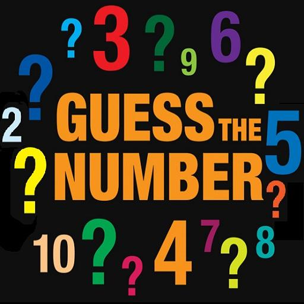
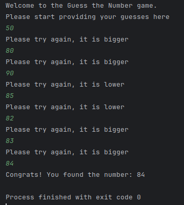
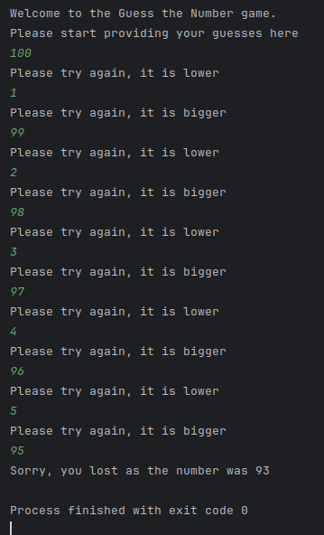

# Guess the number console game
This is a small console game where the user needs to guess a chosen number by our computer.

## Current game implementation
You need to select a number from 0 to 100 and in case you are right, you win! Otherwise, the computer
will provide you a small hint saying if you are lower or upper the winning number.

## Rules
You have up to 10 guesses to give the correct number, otherwise you lose. Do not worry, on every failure
you will receive a useful hint.

### You have win screenshot

### You have lost screenshot

## Source code shortcut
[Rock, Paper and Scissors game source coude shortcut](GuessTheNumber.java)
