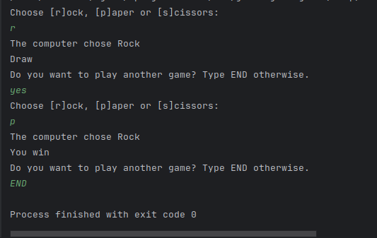

# Rock Paper and Scissors Game
The rock, paper and scissors game is a popular hand game that is generally played between two people. The possible
shapes to select are shown in the image below. The options shall be selected simultaneously by each player. Based on the
result, the possible game outcome could be: draw, win or loss.

## Current game implementation
In this version of the game only the console line is used as interactive (input) method. You shall use it to provide
your selected shape and try to beat the computer. Good luck!

## Rules
You start with 3 points and for each game you won, you get one additional point, otherwise you lose one point. In case
of draw, no points are lost. You can play the game until END is introduced inside the console, or user gets out of
points.

## Source code shortcut
[Rock, Paper and Scissors game source coude shortcut](RockPaperScissors.java)